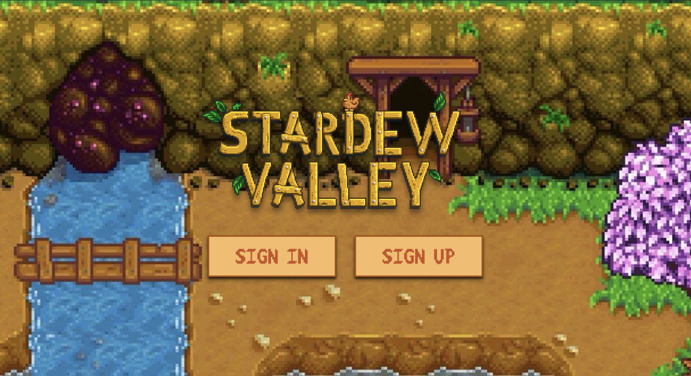
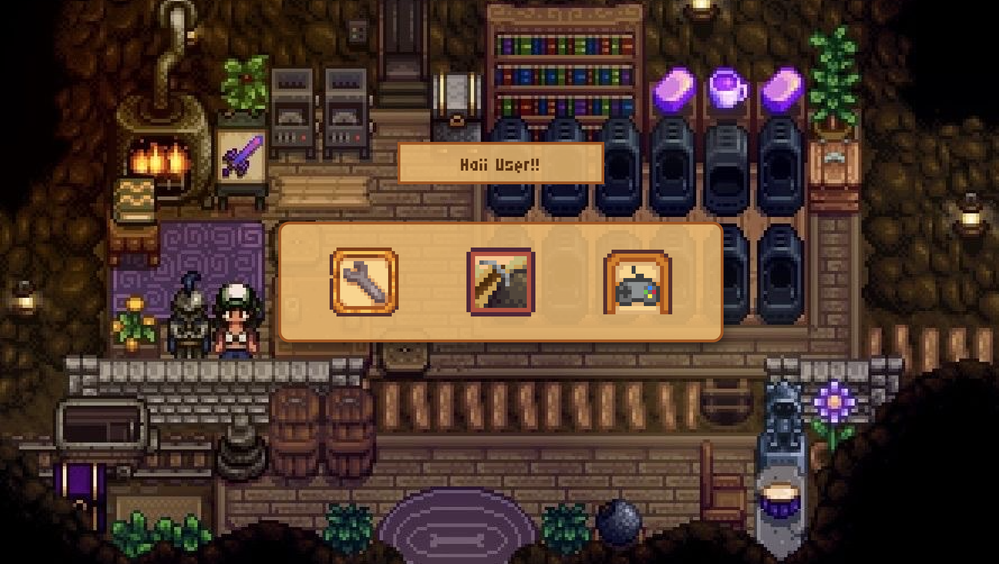
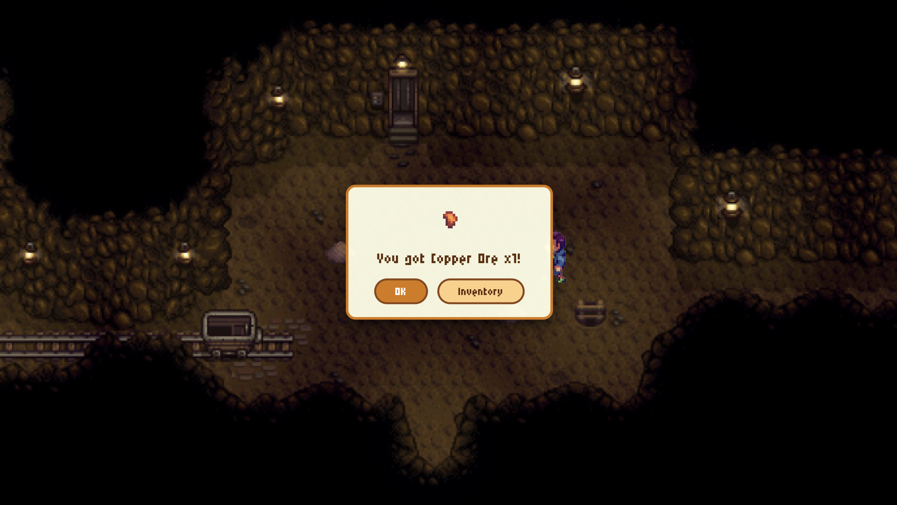
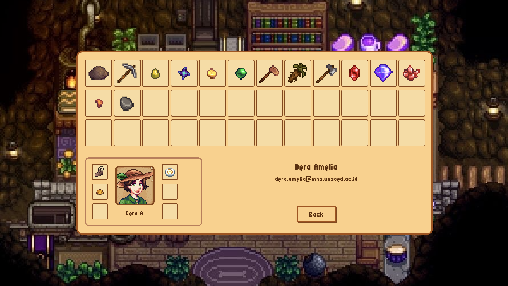
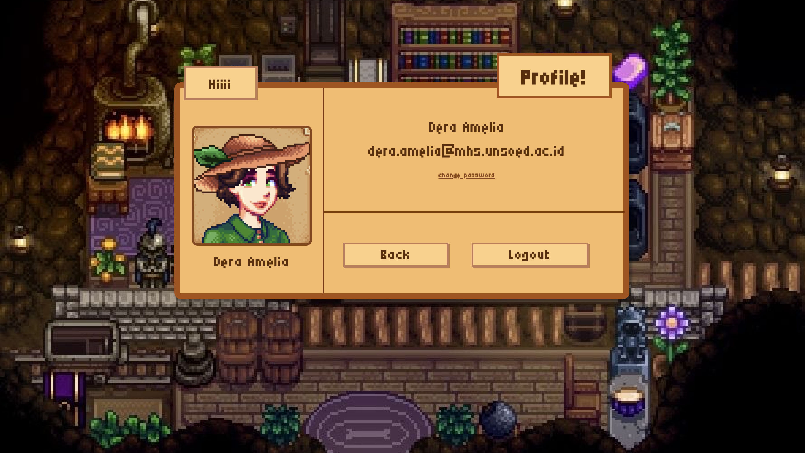

# Stardew Valley Web Project

Project ini merupakan implementasi website dengan tema **Stardew Valley** yang dibuat sebagai bagian dari pengembangan aplikasi berbasis web. Tampilan dan konsep aplikasi terinspirasi dari game Stardew Valley yang memiliki gaya visual dan nuansa simulasi kehidupan.

## Deskripsi

Aplikasi ini berfokus pada pengembangan tampilan antarmuka (user interface) berbasis web dengan pendekatan desain yang menarik dan interaktif. Project ini menampilkan elemen-elemen visual yang terinspirasi dari game Stardew Valley yang dikenal dengan konsep simulasi kehidupan seperti bertani, berinteraksi, dan eksplorasi. :contentReference[oaicite:0]{index=0}

## Tujuan Project

Project ini dibuat untuk memenuhi tugas akhir dari mata kuliah **Praktikum Pemrograman Web 1**.

Selain itu, tujuan dari project ini adalah:

- Mengimplementasikan konsep dasar pengembangan web
- Melatih pembuatan tampilan antarmuka (UI) yang responsif dan menarik
- Mengaplikasikan HTML, CSS, dan JavaScript dalam pembuatan website
- Mengembangkan kemampuan dalam membangun front-end aplikasi web

## Peran dalam Project

Dalam project ini, saya berperan sebagai **Front-End Developer** yang bertanggung jawab dalam:

- Mendesain tampilan antarmuka website
- Mengimplementasikan layout menggunakan HTML dan CSS
- Menambahkan interaktivitas menggunakan JavaScript
- Menyesuaikan tampilan agar user-friendly

## Teknologi yang Digunakan

- HTML
- CSS
- JavaScript

## Pratinjau Antarmuka (UI Preview)

### Halaman Utama & Login

### Dashboard & Gameplay (Mining)

### Inventory & Profil Pengguna

